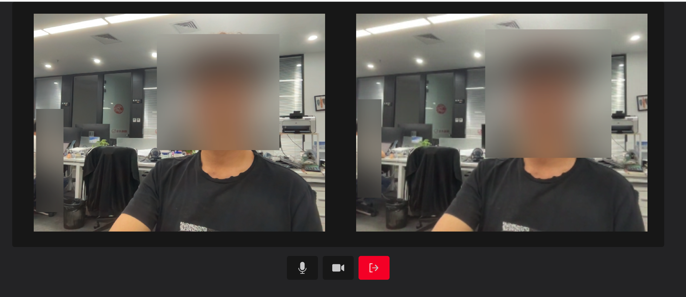

# 使用 vue3 + antd 实现的 WebRTC 一对一视频通话

## 运行项目

1. 启动 serve

   执行命令

   ```bash
   npm run serve
   # or
   yarn serve
   ```

2. 启动 WebRTC 客户端

   ```bash
   yarn dev
   ```

打开[http://localhost:5173](http://localhost:5173)，复制一个页签

**用户名唯一，房间号必须相同**

效果如图

