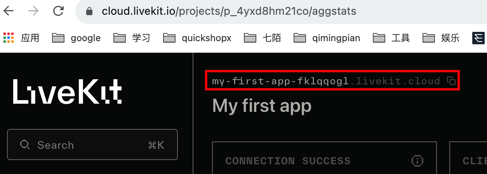

## 原 README

https://github.com/livekit-examples/meet#readme

## 开发步骤

1. 使用 `yarn install` 安装依赖；
2. 将 `.env.example` 重命名为 `.env.local`；
3. 修改 `.env.local` 的环境变量；

   `LIVEKIT_API_KEY` 和 `LIVEKIT_API_SECRET` 在 [settings](https://cloud.livekit.io/projects/p_4yxd8hm21co/settings/keys)界面新增；
   `LIVEKIT_URL` 是红框这个地址；
   
   `NEXT_PUBLIC_LK_TOKEN_ENDPOINT=/api/token` 是获取 token 的请求接口。

   **LIVEKIT_URL和token用于连接房间，token 是唯一的，如果多个参与者使用相同的 token 连接，则较早的参与者将与房间断开连接。**

4. 运行 `yarn dev` 后，打开[http://localhost:3000](http://localhost:3000) 预览
